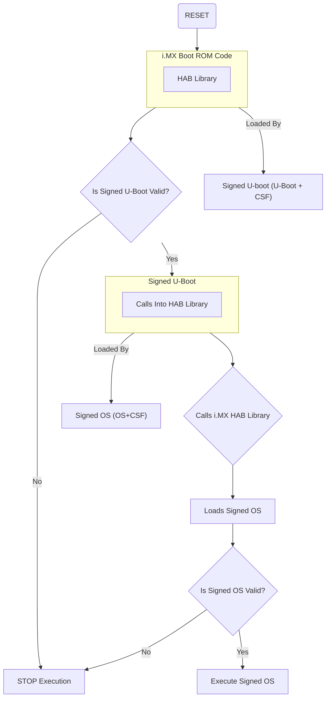

# Secure Boot for embedded systems

Secure boot is a critical security mechanism designed to protect embedded systems against various threats, such as physical memory modification and malicious code injection.

When you power on an embedded device, it initiates a boot process. This process involves the execution of boot code stored on the device’s chip, and in some cases, it simultaneously launches additional code and applications. Once the boot process concludes, the device becomes operational.

However, when Secure Boot is in place, code doesn’t run simply because it resides on the device. Secure Boot’s primary function is to ensure that only code signed by the device’s manufacturer is executed.

Once the secure code begins execution, any additional code and applications will only run if their signature is valid. This creates a hierarchical “chain of trust” where each layer of code and application is executed only if the correct key validates it.

   
