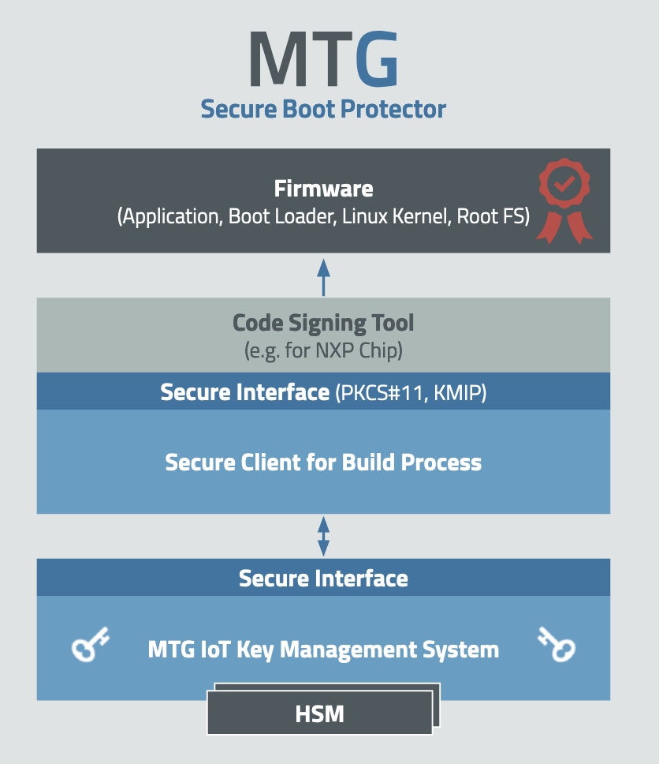
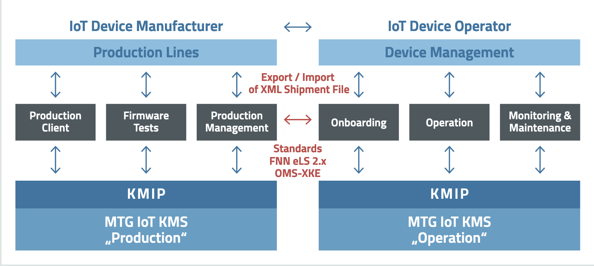

# MTG KMS & PKI Ecosystem

When referring to MTG Secure Boot Protector as a whole, following visualization should help clear misconceptions about the nature and function of it;

MTG Secure Boot serves as a bundle of MTG's secure Client, interfacing securely with the wider MTG IoT Key Management System.

  The MTG IoT KMS offers unparalleled interoperability with not only MTG'S Public Key Infrastructure but also third party, already existing ones. The open interface, developed according to the international OASIS KMIP standard, allows the MTG KMS to connect seamlessly between all specific IOT applications. From secure key handling (HSM backend) to Role based access rights, while simultaneously offering production & testing keys for different types of users, the options are virtually unlimited. The already present Public Key Infrastructure integration means that keys can be generated on the fly, but there is also the option of using PKIs already in place and set up (interfacing it with the Secure Boot Protector). Automatic signature generation during building is possible through the dedicated CLI build system integration. On top of that, for production releases where automatically generated signatures may not be an option due to security concerns, the process can be completed manually.
 

The following key functions of the MTG IoT KMS are the essence of the easy integration mentioned above;

- Complete key management life cycle
- Control & Compliance
- KMIP Interface
- KMIP Client Library
- REST Interface & Adapters
- Vendor independent HSM
- PKI Integration
- Consulting & Support

 For a more detailed overview, please refer to [this flyer](https://www.mtg.de/export/sites/default/.galleries/documents/pdf/MTG_Flyer_KMS_202209_eng.pdf).
